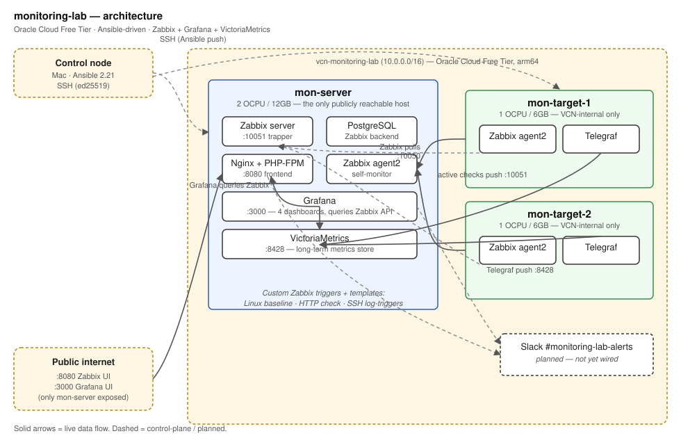

# Architecture

## Control plane

- **Control node** — a Mac (previously a Windows laptop, migrated 2026-09-22) running Ansible 2.21. Runs playbooks over SSH using a dedicated ed25519 key authorized on all 3 VMs.
- **Inventory** — declarative YAML at `inventories/production/hosts.yml`, split into `monitoring_servers` (1 host) and `monitoring_targets` (2 hosts) groups.
- **Secrets** — Ansible Vault–encrypted file at `inventories/production/group_vars/all/vault.yml`. Password loaded from a local, gitignored `.vault-pass` file.
- **Idempotency** — a full `ansible-playbook site.yml` run is `changed=0, failed=0` on a second pass across all 3 hosts. This is checked in CI (`molecule test` on `common` and `zabbix-agent`) and manually before every commit that touches a role.

## Data plane

- **mon-server (1×, 2 OCPU/12GB)** — Zabbix server + PostgreSQL backend + Nginx/PHP-FPM frontend + Grafana + VictoriaMetrics. The only host with public ports open (`:8080` Zabbix UI, `:3000` Grafana UI); everything else is VCN-internal only.
- **mon-target-1 / mon-target-2 (2×, 1 OCPU/6GB each)** — Zabbix agent2 + Telegraf. Each target is monitored two independent ways: Zabbix pulls standard host metrics (CPU/memory/disk/network) over passive checks, and Telegraf independently pushes a wider metric set to VictoriaMetrics.

All 3 VMs are Oracle Cloud Free Tier `VM.Standard.A1.Flex` (Ampere/arm64) instances in `eu-frankfurt-1`, inside a single VCN (`vcn-monitoring-lab`).

## Data flow

- **Zabbix**: agent2 on each target exposes items over `:10050` (passive, server-pull) and also pushes active-check data to the server's trapper on `:10051`. Zabbix server writes everything into PostgreSQL.
- **Telegraf → VictoriaMetrics**: each target's Telegraf agent collects `cpu`/`mem`/`disk`/`diskio`/`net`/`processes`/`swap` on a 15s interval and writes to VictoriaMetrics's `/write` endpoint (InfluxDB v1 line-protocol compatible) on `:8428`, VCN-internal only.
- **Grafana**: queries the Zabbix API directly (via the `alexanderzobnin-zabbix-app` plugin) for all 4 dashboards. It does not currently query VictoriaMetrics as a datasource — VictoriaMetrics is deployed and receiving real data, but wiring a second Grafana datasource for it is a natural next step, not yet done.

## Zabbix templates

- **Linux by Zabbix agent** (stock) — base OS metrics on every host.
- **Linux baseline triggers** — 4 custom triggers layered directly onto the stock template (high CPU load, low available memory, low free swap, reboot detection). These aren't a separate template: Zabbix determines a trigger's owning template from the items its expression references, not from what you tell the API when creating it — a real gotcha hit and documented in `roles/zabbix-server/tasks/custom_templates.yml`.
- **HTTP Check** (custom, mon-server only) — a server-side `simple_check` against the Zabbix frontend port. No agent dependency.
- **Log Triggers** (custom, all hosts) — active log monitoring on `/var/log/auth.log` for repeated failed SSH logins.

All templates, host registration, and trigger definitions are created idempotently from Ansible via the Zabbix API (`community.zabbix` collection over the `httpapi` connection plugin) — nothing is clicked into place manually in the UI.

## Alerting

Two independent alert paths are planned — deliberate, to demonstrate multi-tool alerting:

1. **Zabbix triggers** → Slack webhook (via a Zabbix media type)
2. **Grafana alert rules** → Slack webhook (via a Grafana contact point)

Both would land in the same Slack channel. **Not yet built** — blocked on setting up a Slack workspace for this project; `vault_slack_webhook_url` is still a placeholder in the vault.

## Diagram source

The diagram above is a hand-authored SVG at `docs/diagrams/architecture.svg` (no Excalidraw dependency — renders natively on GitHub). Solid arrows show live data flow; dashed arrows show control-plane traffic (SSH from the control node) or the planned Slack alerting path.
